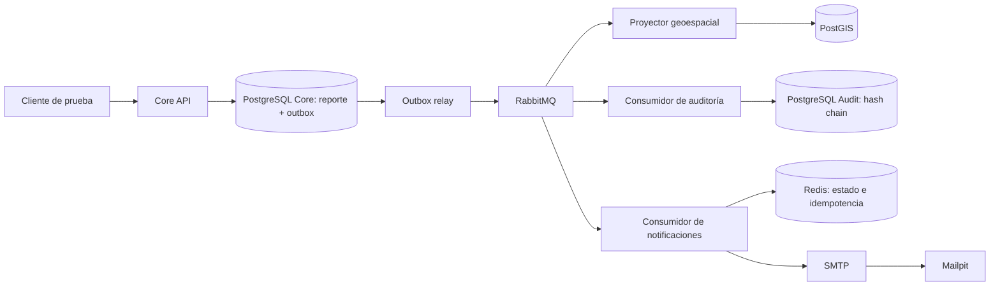

# Pruebas del flujo completo Urban Alert

**Fecha de ejecución:** 2026-09-30  
**Entorno:** Docker Compose local, PostgreSQL, RabbitMQ, Redis, PostGIS, SMTP capturado por Mailpit. No se enviaron correos a destinatarios externos.

## Alcance

El recorrido de éxito verifica:



La prueba de falla controla el puerto SMTP del consumidor temporal, verifica los reintentos y que el evento termine en la DLQ. Los IDs únicos permiten distinguir estos resultados de datos previos.

## Preparar el entorno

Desde la raíz del repositorio:

```powershell
docker compose config --quiet
docker compose up -d
docker compose ps
```

Esperar a que RabbitMQ y las bases estén saludables y confirmar que los consumidores estén activos. Mailpit debe estar `healthy`; su bandeja local está en <http://localhost:8025>.

No usar `docker compose down -v`: borra los volúmenes persistentes y no es necesario para estas pruebas.

## Flujo feliz

El perfil se crea/actualiza por la API local usando un UUID de identidad reservado para pruebas y un dominio `.test`. `X-User-Context` solo está habilitado por la configuración local de desarrollo.

```powershell
$headers = @{
  "X-Urban-Gateway-Key" = "urban-alert-local-gateway-secret-change-before-deploy"
  "X-User-Context" = '{"sub":"66666666-6666-4666-8666-666666666666","role":"ciudadano","municipio_id":"22222222-2222-4222-8222-222222222222"}'
}
$profile = @{
  email = "mario.bross@example.test"
  displayName = "Mario Bross"
  municipioId = "22222222-2222-4222-8222-222222222222"
} | ConvertTo-Json
Invoke-RestMethod -Method Put -Uri http://localhost:5001/usuarios/me `
  -Headers $headers -ContentType "application/json" -Body $profile

$correlationId = [guid]::NewGuid().ToString()
$reportBody = @{
  descripcion = "Reporte integral de prueba para validar outbox, geoespacial, auditoria y correo."
  categoria = "alumbrado"
  ubicacion = @{ lat = 4.65; lon = -74.05 }
  municipio_id = "22222222-2222-4222-8222-222222222222"
  correlationId = $correlationId
} | ConvertTo-Json -Depth 5
$created = Invoke-RestMethod -Method Post -Uri http://localhost:5001/reportes `
  -Headers $headers -ContentType "application/json" -Body $reportBody
$reportId = $created.report.report_id
$reportId
```

Usar el `reportId` devuelto en las siguientes consultas.

1. Verificar que el evento se confirmó desde outbox a RabbitMQ:

```powershell
docker compose exec -T core_db_primary psql -U core_admin -d urban_alert_core -c `
  "SELECT tipo, publicado_en FROM outbox_eventos WHERE payload->>'reportId' = '$reportId'"
```

`publicado_en` debe tener valor.

2. Confirmar la proyección PostGIS:

```powershell
docker compose exec -T postgis_db psql -U gis_admin -d urban_alert_geo -c `
  "SELECT estado, categoria, ST_X(geom) AS lon, ST_Y(geom) AS lat FROM reportes_geo WHERE reporte_id = '$reportId'"
```

Esperado: `RECIBIDO`, `alumbrado`, `-74.05`, `4.65`.

3. Consultar el historial de auditoría. La identidad debe ser la dueña del reporte:

```powershell
Invoke-RestMethod -Method Get `
  -Uri "http://localhost:5001/auditoria/reportes/$reportId?limit=20" `
  -Headers $headers | ConvertTo-Json -Depth 8
```

Debe aparecer `reporte.creado` con `eventId` y `hash`.

4. Consultar el estado de notificación en Redis, usando el `eventId` devuelto por auditoría:

```powershell
docker compose exec redis redis-cli GET "notification:<eventId>"
```

Esperado: `status` igual a `SENT` y `attempts` mayor o igual que 1. En Mailpit se comprueban destinatario, asunto y contenido del correo.

## Idempotencia

Ejecutar la prueba integrada de notificaciones:

```powershell
.\.venv\Scripts\python.exe .\scripts_test\test_notifications_redis.py
```

El script publica el mismo evento dos veces y verifica que el estado Redis no cambia, que el TTL existe y que Mailpit capturó el correo. El consumidor debe registrar el duplicado como omitido; no debe enviar un segundo mensaje.

## Reintentos y DLQ

Este escenario provoca un rechazo SMTP controlado sin modificar el Mailpit normal. Primero se pausa el consumidor para que solo procese la instancia temporal:

```powershell
docker compose stop fn_notifications
docker compose run -d --no-deps `
  --name urban-alert-notifications-failure-test `
  -e SMTP_PORT=1 fn_notifications
```

Con ese consumidor activo, crear otro reporte con un `correlationId` nuevo usando la petición del flujo feliz. La conexión a `mailpit:1` fallará. Localizar el `eventId` de ese reporte en la respuesta de auditoría y comprobar Redis:

```powershell
docker compose exec redis redis-cli GET "notification:<eventId>"
```

Esperado: `status=FAILED` y `attempts=3`. Verificar que el mensaje está en la DLQ:

```powershell
docker compose exec rabbitmq rabbitmqctl list_queues -p / name messages_ready consumers
```

La cola `q_dead_letter_notifications` debe aumentar en uno. Para restaurar el consumidor normal:

```powershell
docker rm -f urban-alert-notifications-failure-test
docker compose up -d fn_notifications
```

La prueba controlada anterior leyó el mensaje de la DLQ y lo devolvió con `nack/requeue`; no lo confirmó ni lo borró. Revisar la cola antes de repetir el escenario para no confundir un mensaje de prueba anterior.

`test_dlq_routing.py` no fuerza actualmente un fallo del proveedor: publica eventos válidos. No usarlo como evidencia de reintentos/DLQ SMTP sin inyectar primero el fallo controlado descrito aquí.

## Resultados registrados

| Caso | Resultado observado |
| --- | --- |
| Flujo feliz API → outbox/RabbitMQ → PostGIS | OK. Reporte `0cd32b42-158a-4b28-ad56-4fe17ff01223`; outbox publicado; PostGIS `RECIBIDO`, `alumbrado`, `(-74.05, 4.65)`. |
| Auditoría | OK. Evento `cd930d6d-7f55-46b0-be28-f221246a798f`, hash SHA-256 presente. |
| Notificación SMTP local | OK. Redis `SENT`, un intento; correo capturado por Mailpit para `mario.bross@example.test`. |
| Idempotencia | OK. Reenvío conserva el estado Redis y el consumidor omite el duplicado. |
| Falla SMTP / reintentos / DLQ | OK. Reporte `3a307254-9a39-4493-9bb4-af22641a75d9`; 3 intentos; evento `f2100b9c-afca-4149-9a06-eecdcca7c1c5` llegó a `q_dead_letter_notifications`. |
| PostgreSQL réplica y RabbitMQ | OK. La réplica quedó `healthy` y transmitiendo WAL; RabbitMQ `healthy`. |

Las pruebas unitarias complementarias siguen disponibles en `scripts_test/test_audit_persistence.py`, `scripts_test/test_audit_persistence_db.py`, `scripts_test/test_audit_api.py` y `scripts_test/test_contract_consumers.py`.

## SMTP de producción

Compose usa Mailpit, que captura mensajes localmente. Para entregar correo externo configurar en el entorno del despliegue `SMTP_HOST`, `SMTP_PORT`, `SMTP_FROM_EMAIL`, `SMTP_STARTTLS=true`, `SMTP_USERNAME` y `SMTP_PASSWORD` con un relay autorizado (por ejemplo Amazon SES SMTP o SendGrid). Las credenciales deben venir de un gestor de secretos y no guardarse en el repositorio.
